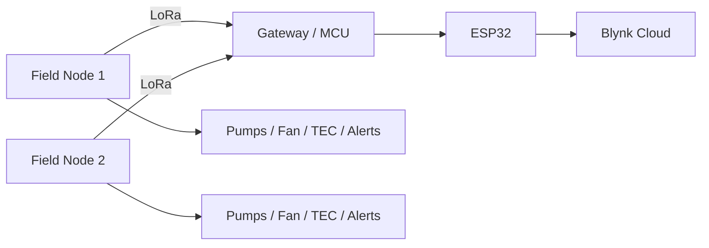

# Smart Agriculture Monitoring & Control System

<p align="center">
  <strong>Distributed LoRa-based agriculture monitoring with local automation and cloud telemetry</strong>
</p>

<p align="center">
  
  
  
  
</p>

## Project at a Glance

| Item | Details |
|---|---|
| Domain | Smart agriculture |
| Architecture | Multi-node embedded system |
| Wireless link | LoRa |
| Gateway | ESP32 |
| Sensors | Soil, pH, temperature, humidity, probe temperature, water level |
| Actuation | Pumps, fan, thermoelectric control, LEDs, buzzer |
| Status | Academic engineering prototype |

## Overview

Multiple field nodes monitor agricultural conditions and perform local actuator control. LoRa transports field data to a gateway, while an ESP32 forwards telemetry to Blynk for remote monitoring.

## System Architecture



## Main Features

- Multi-node agriculture monitoring
- Soil moisture and pH sensing
- Ambient and probe temperature
- Humidity and water-level monitoring
- Automatic pump and fan control
- Thermoelectric heating/cooling logic
- LED and buzzer alerts
- LoRa telemetry
- ESP32 cloud gateway
- Blynk dashboard integration

## Repository Structure

```text
smart-agriculture/
├── codes/
│   ├── board1/
│   ├── board2/
│   ├── esp/
│   └── mkr/
├── BOARD1.fzz
├── Block Diagram.drawio
├── FLOWCHART.drawio
├── RECEIVER_FLOW.drawio
└── smart_agriculture.docx
```

## Security

Wi-Fi credentials and Blynk tokens are represented with placeholders in the public source. Real credentials should not be committed.

## Future Work

- Local configuration file for secrets
- MQTT transport
- Local data logging
- Soil/weather forecasting
- OTA firmware updates
- Solar/battery telemetry
- Gateway parser tests

## Author

**Sadik Shaik**

Computer Engineering · Embedded Systems · IoT
